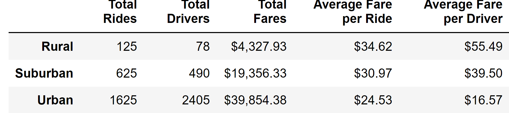
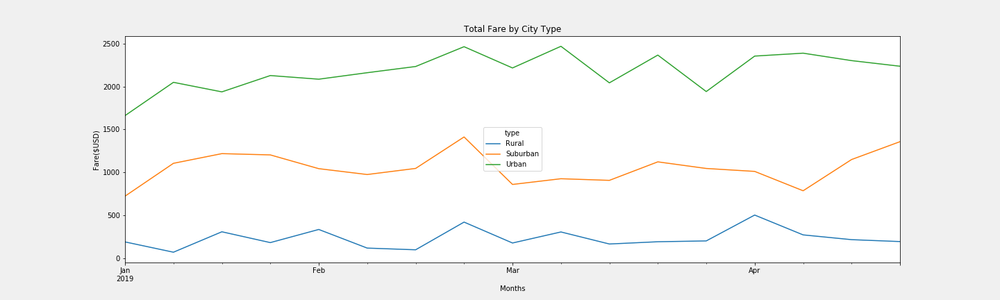

# PyBer_Analysis

## Overview

Utilizing Pandas and Matplotlib, data from a ride sharing company (PyBer) was graphed to analyze the differences in total fares between city types (urban, suburban, and rural). The data was specifically for the time period of January 1, 2019 to April 29, 2019. It was then resampled to show total fares per week, and finally graphed on a multiple line graph. Through this data visualization, conclusions can be drawn regarding the relationship between city type and total fares accumulated per week, which then allows for recommendations to be made to help address disparities that exist. 

## Results

As shown in the PyBer Summary DataFrame, total rides, total drivers, and total fares all increase from rural to suburban to urban. However, average fare per ride and average fare per driver. This could be due to people in urban areas being more willing to use ride services for short distance trips, as even going a few blocks in a crowded city can be difficult. Rural customers are more likely to use ride services to go longer distances, as things tend to be more spread out in rural areas. It should also be noted that rural areas tend to be less densely populated than urban areas, which explains the change in total rides. These components rationalize why rural areas tend to have higher fares but tend to have lower total rides given. 

This rationale also applies to the Total Fare by City Type graph. Throughout the time period given, urban areas always had higher total fares than suburban cities, which always had higher toal fares than rural cities. While rural cities have a high average fare per ride, urban areas gross more in fares due to giving more total rides. Therefore, when comparing total fares, urban cities will most likely always come out on top. 

  

## Summary

Using the information gathered through the Summary DataFrame and Total Fare Graph, some recommendations can be made to address the disparities between the city types. Firstly, you could try lowering fares in rural areas in order to entice new customers to try your app. While there would certainly be a short-term loss in potential profits, you could easily gain in the long-term by roping in new customers and then slowly returning to the original fare calculations once they realize how convenient your services are. Doing this would increase total rides given but lower average fare per ride but would ideally compensate for the smaller pool of potential customers present in rural cities compared to suburban and urban ones. 

On a similar note of the first recommendation, you could run promotional programs only available in rural and suburban areas at first. These programs would be designed to gain new first-time customers and would ideally lead to repeat business. Such programs have been used by other ride sharing and delivery apps in the past. They give perks to brand new customers, such as discounted or outright free services for the first order. This would also lead to an increase in total rides and a decrease in average fare per ride and could lead to rural and suburban total fares slightly catching up with urban ones. If successful, such programs could eventually be targeted at urban areas, as well. 

Finally, you could run a referral program that would give rewards to account holders that get others to sign up and use your services. The rewards themselves do not even have to be that amazing, as just the prospect of earning free services is enough to entice people to participate. This would have the same effect as the other recommendations and could be targeted first at rural areas to see if it has a stark enough effect on the total fare disparity. 
